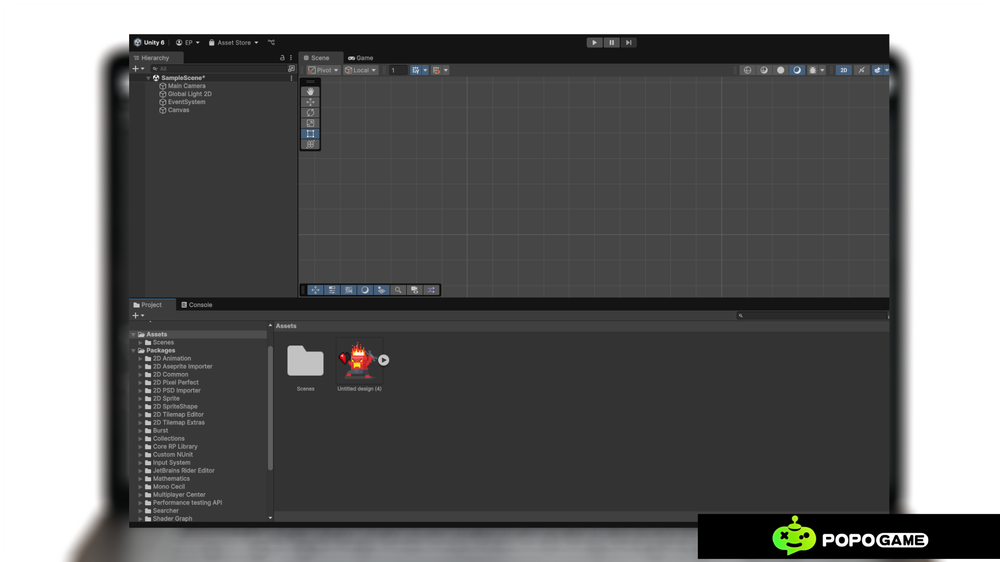
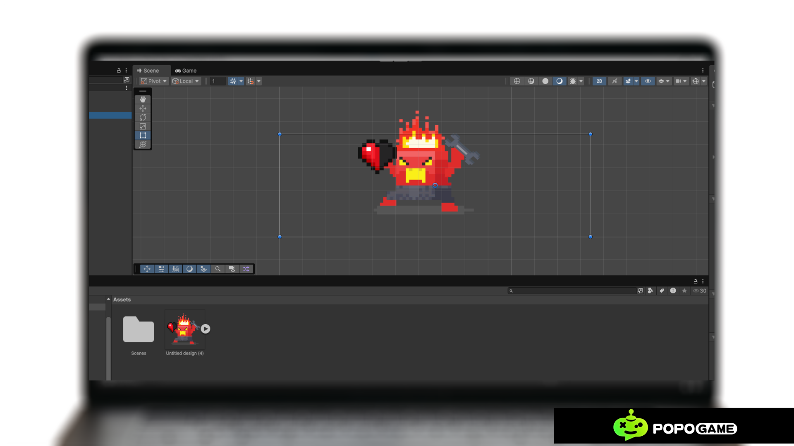

# Introduction-to-Unity-2D

Unity is one of the most popular game development platforms globally, used by both professional and beginner developers to create interactive and engaging games. One of Unity's standout features is Unity 2D, specifically designed to support the creation of two-dimensional (2D) games. This article provides an overview of what Unity 2D is, its features, and why this platform is ideal for creating 2D games.

# What is Unity 2D?
Unity 2D is a specialized mode in Unity focused on developing two-dimensional games. This mode is equipped with various tools and components to manage graphics, animations, physics, and game logic in a 2D space. With Unity 2D, developers can easily create games such as platformers, puzzles, RPGs, or even non-game interactive applications.

# Key Features of Unity 2D

## 1. Sprites and 2D Graphics

Sprites are the main visual elements in 2D games, such as characters, backgrounds, or other objects within the game. Unity supports importing various image formats to be converted into sprites. Using the Sprite Editor, developers can slice, organize, and optimize graphical assets as needed.
## 2. 2D Physics System
Unity 2D has a built-in physics engine to create realistic interactions in games. Some key components include:
- Rigidbody2D: For managing gravity and object movement.
- Collider2D: For detecting collisions between objects.
- Joint2D: For dynamically connecting objects, such as creating rope or wheel effects.
## 3. 2D Animation
Unity provides intuitive animation tools to bring sprites to life:
- Animator: A tool to manage transitions and relationships between animations.
- Animation Window: To create frame-by-frame animations or use rigging for smooth motion.
## 4. Scripting with C#
Unity uses C# to add logic to games. Scripting allows developers to:
- Set up player controls.
- Create interactions between objects.
- Add features like scoring, timers, or special effects. C# is known for being both powerful and beginner-friendly, making the learning process easier.
## 5. Intuitive User Interface (UI)
Unity’s interface consists of several main panels, including:
- Scene View: To arrange game elements.
- Game View: To see how the game runs.
- Inspector: To configure object properties.
- Hierarchy: To manage the hierarchy of objects in the game. These panels are designed to help developers work efficiently.

# Sprites in Unity
Sprites are simple 2D graphic objects that have graphical images (called textures) on them. Unity handles sprites by default when the engine is in 2D mode.
If you are 3D, sprites are essentially just standard textures, but there are special techniques for combining and managing sprite textures for efficiency and convenience during development. When you view the sprite in 3D space, sprites will appear to be paper-thin, because they have no Z-width.
Sprites always face the camera at a right angle unless rotated in 3D space.
When you create a new sprite, it uses a texture. This texture is then applied on a fresh GameObject, and the Sprite Renderer component is attached to it. This makes our GameObject visible with our texture, as well as its properties related to how it looks on-screen.

# Creating Sprites
To create a sprite to your game, you must supply the engine with a texture. Let's create a texture first.
- Get an image what you want to add as a sprite in standard image file such as PNG or JPG that you want to use,
- Save it in your system directory and
- Then drag the image into the Assets region of Unity.

- Now drag the image from the Assets into the Scene Hierarchy.
You will notice that as soon as you let go of the mouse button, a new GameObject with the name of the texture shows up in the list. You will also get the image now in the middle of the scene in the scene view.

Let us consider the following points while adding a sprite:
- By dragging from an external source into Unity, we are putting an asset.
- This added asset is an image, so it becomes a texture.
- By dragging this texture into the scene hierarchy, we are creating a new GameObject with the same name as our texture, with a sprite renderer attached.
- This sprite renderer uses that texture draws the image in the game.
We have now added a sprite in our scene.

# Sprite Modes
This setting is used to specify how the sprite graphic is extracted from the image. To choose the modes, click on a sprite in the Assets/ Sprites folder, in the inspector, there are three different modes in which you can use Sprites:

- Single: It is used for a single image sprite.
- Multiple: It is used for a sprite with multiple elements, such as animations or spritesheets, with different parts for a character.
- Polygon: It is used for a custom polygon-shaped sprite that you can create many different types of primitive shapes with, for example, Square, Triangle, Pentagon, Hexagon, etc.

# Modifying Sprites
We can manipulate the imported sprites in various ways to change how it looks.
If you look at the top left corner of the scene, you will get a toolbar, as shown below:

Let's see the functions of these buttons:
- A first View tool is used to move around the scene without affecting any objects.

- The next tool is the Move tool. This is used to move the objects in the game world around.

- The next tool is the Rotate tool, which is used to rotate objects along the Z-axis of the game world or parent object.

- The next tool is the Scale tool. This tool allows you to modify the size (scale) of the objects along certain axes.

- The next tool is the Rect tool. This tool behaves like a combination of the Move and the Scaling tool but is prone to loss of accuracy. It is more useful in arranging the UI elements.

- The next tool is the Transform tool. It is used to move, rotate, and scale the selected object.

These tools are very useful and worthy as the complexity of the project increases.
Last final this option right now. 

